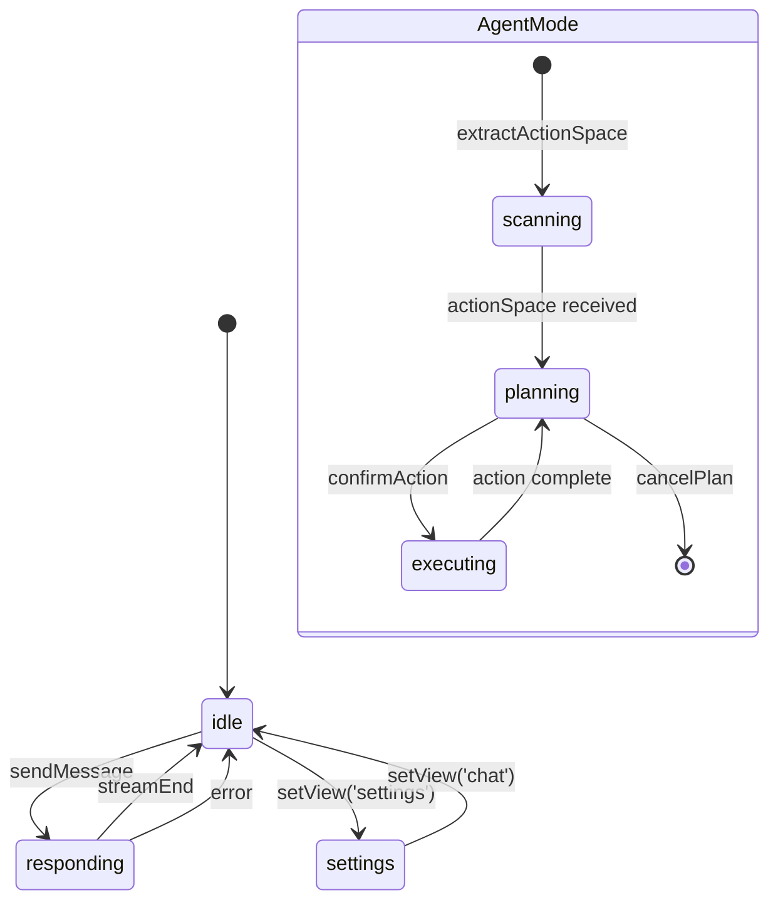
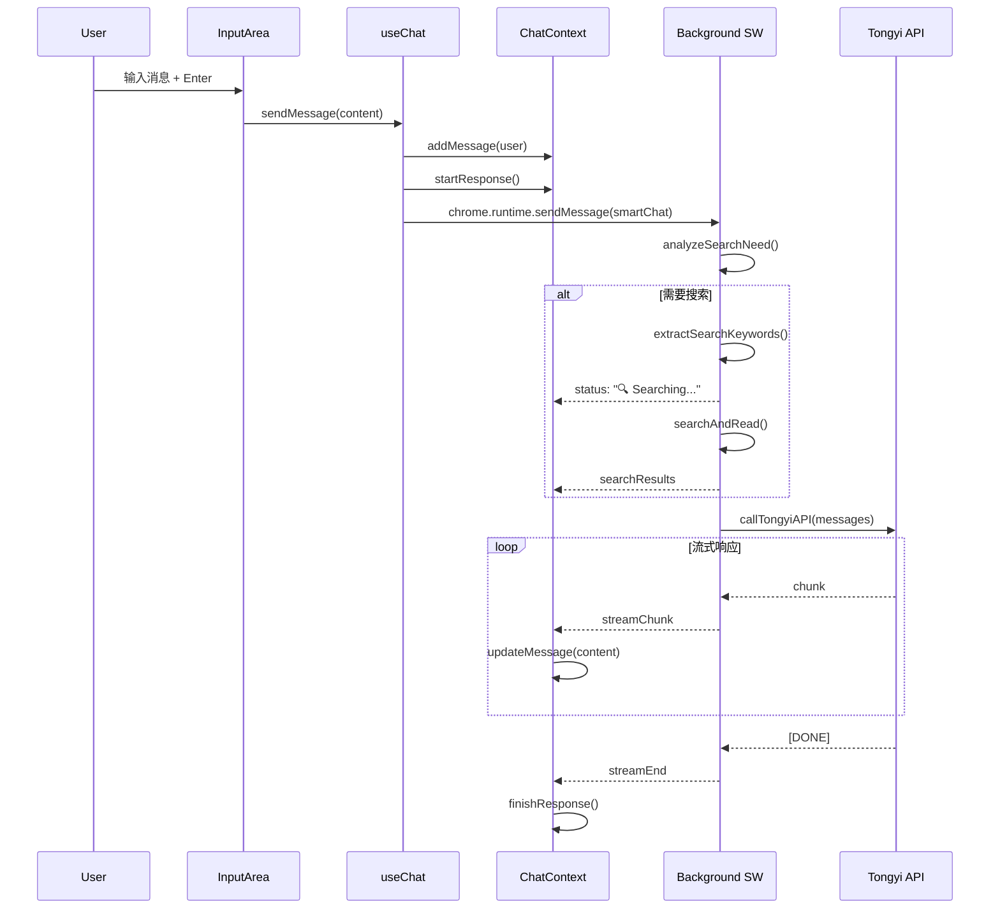
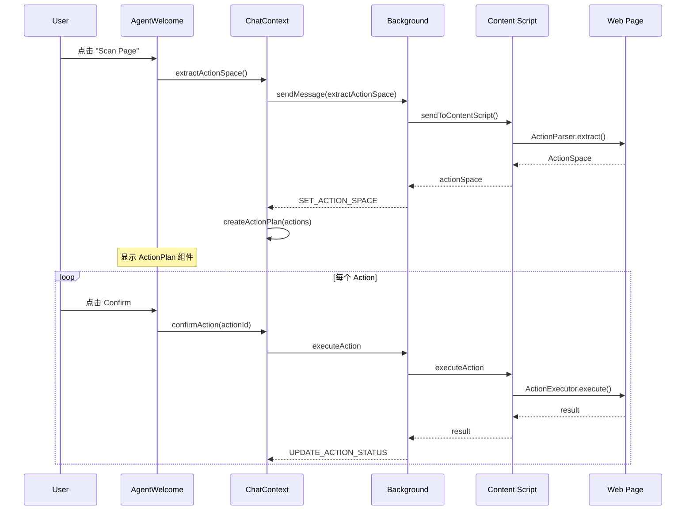

# Madoka 前端架构文档

> 本文档详细描述 Madoka 浏览器扩展的前端 UI 架构，方便后续开发和维护参考。

## 目录

- [整体架构](#整体架构)
- [组件层级结构](#组件层级结构)
- [状态管理](#状态管理)
- [主题系统](#主题系统)
- [动画系统](#动画系统)
- [关键数据流](#关键数据流)
- [组件详解](#组件详解)

---

## 整体架构

### 技术栈

| 技术 | 用途 |
|-----|------|
| React 18 | UI 框架 |
| TypeScript | 类型安全 |
| TailwindCSS | 样式系统 |
| Framer Motion | 动画库 |
| CSS Variables | 主题切换 |
| Chrome Storage | 数据持久化 |

### 目录结构

```
src/sidepanel/
├── App.tsx                    # 应用入口，布局容器
├── main.tsx                   # React 挂载点
├── index.html                 # HTML 模板
├── index.css                  # 全局样式 + 主题变量
│
├── context/
│   └── ChatContext.tsx        # 全局状态管理（核心）
│
├── hooks/
│   ├── useChat.ts             # 聊天逻辑封装
│   ├── useTheme.ts            # 主题切换 Hook
│   ├── useSettings.ts         # 设置管理 Hook
│   └── usePageReader.ts       # 页面读取 Hook
│
├── styles/
│   ├── theme.ts               # 主题工具函数
│   └── animations.ts          # Framer Motion 动画配置
│
└── components/
    ├── layout/                # 布局组件
    │   ├── Sidebar.tsx        # 侧边栏容器
    │   └── ModeSwitch.tsx     # Chat/Agent 模式切换
    │
    ├── sidebar/               # 侧边栏子组件
    │   ├── ConversationList.tsx
    │   └── ConversationItem.tsx
    │
    ├── composer/              # ⭐ Cursor 风格输入组件
    │   ├── Composer.tsx       # 主输入区域（支持 @ 引用）
    │   ├── ContextPicker.tsx  # @ 引用选择菜单
    │   ├── AttachedContextBar.tsx # 已选上下文标签
    │   └── index.ts           # 导出
    │
    ├── common/                # 通用组件
    │   └── ThemeToggle.tsx    # 主题切换按钮
    │
    └── [核心组件]
        ├── Message.tsx        # 消息气泡
        ├── MessageList.tsx    # 消息列表
        ├── InputArea.tsx      # 输入区域（已废弃，使用 Composer）
        ├── Welcome.tsx        # 欢迎页
        ├── Header.tsx         # 头部（旧版）
        ├── SettingsPanel.tsx  # 设置面板
        └── ActionPlan.tsx     # Agent 操作计划
```

---

## 组件层级结构

### UI 组件树

```
App (ChatProvider)
│
├── Sidebar                        # 侧边栏（可折叠）
│   ├── Header (Logo + Theme)
│   ├── NewConversationBtn
│   ├── ConversationList
│   │   └── ConversationItem[]     # 对话列表项
│   └── Footer (Settings)
│
└── MainContent                    # 主内容区
    ├── Header
    │   ├── SidebarToggle (可选)
    │   ├── ModeSwitch             # Chat/Agent 切换
    │   └── StatusIndicator
    │
    └── Main (基于 mode 切换)
        │
        ├── [Chat Mode]
        │   ├── Welcome / MessageList
        │   └── InputArea
        │       ├── SearchStatus
        │       ├── QuickActions
        │       ├── PageAttachment
        │       └── TextInput + SendBtn
        │
        └── [Agent Mode]
            ├── AgentWelcome / MessageList
            ├── ActionPlan (条件渲染)
            │   └── ActionItem[]
            └── InputArea
```

### 视觉布局示意

```
┌──────────────────────────────────────────────────────────┐
│ App Container (flex, h-screen)                           │
├─────────────┬────────────────────────────────────────────┤
│   Sidebar   │              MainContent                   │
│   (260px)   │                                            │
│             │  ┌──────────────────────────────────────┐  │
│  ┌───────┐  │  │ Header (ModeSwitch + Status)         │  │
│  │ Logo  │  │  └──────────────────────────────────────┘  │
│  └───────┘  │                                            │
│             │  ┌──────────────────────────────────────┐  │
│  [+ New]    │  │                                      │  │
│             │  │   MessageList / Welcome              │  │
│  ┌───────┐  │  │   (flex-1, overflow-auto)            │  │
│  │ Conv1 │  │  │                                      │  │
│  │ Conv2 │  │  │                                      │  │
│  │ Conv3 │  │  └──────────────────────────────────────┘  │
│  │  ...  │  │                                            │
│  └───────┘  │  ┌──────────────────────────────────────┐  │
│             │  │ ActionPlan (Agent mode only)         │  │
│  ┌───────┐  │  └──────────────────────────────────────┘  │
│  │⚙ Set │  │                                            │
│  └───────┘  │  ┌──────────────────────────────────────┐  │
│             │  │ InputArea (fixed bottom)             │  │
└─────────────┴──┴──────────────────────────────────────┴──┘
```

---

## 状态管理

### ChatContext 核心状态

```typescript
interface AppState {
  // 多对话管理
  conversations: Conversation[]      // 所有对话
  activeConversationId: string | null // 当前激活的对话 ID
  
  // UI 状态
  sidebarOpen: boolean               // 侧边栏展开状态
  theme: 'light' | 'dark'            // 当前主题
  view: 'chat' | 'settings'          // 当前视图
  
  // 聊天状态
  status: 'idle' | 'responding' | 'searching'
  isResponding: boolean
  searchStatus: string | null
  currentEngine: 'bing' | 'google'
}

interface Conversation {
  id: string
  title: string
  mode: 'chat' | 'agent'             // 对话模式
  messages: Message[]
  createdAt: number
  updatedAt: number
  pageContent: PageContent | null
  agent: AgentState                  // Agent 相关状态
}

interface AgentState {
  isAgentMode: boolean
  actionSpace: ActionSpace | null
  actionPlan: ActionPlanItem[]
  currentActionIndex: number
  isExecuting: boolean
  executionHistory: ActionResult[]
}
```

### 状态流转图



### Context 提供的方法

| 方法 | 用途 |
|-----|------|
| `createNewConversation(mode)` | 创建新对话 |
| `switchConversation(id)` | 切换对话 |
| `deleteConversation(id)` | 删除对话 |
| `addMessage(msg)` | 添加消息 |
| `updateMessage(id, content)` | 更新消息（流式） |
| `clearMessages()` | 清空当前对话消息 |
| `setView(view)` | 切换视图 |
| `setMode(mode)` | 切换 Chat/Agent 模式 |
| `toggleSidebar()` | 切换侧边栏 |
| `setTheme(theme)` | 设置主题 |
| `extractActionSpace()` | 提取页面 Action Space |
| `confirmAction(id)` | 确认执行 Action |
| `skipAction(id)` | 跳过 Action |
| `cancelPlan()` | 取消操作计划 |

---

## 主题系统

### CSS 变量定义 (`index.css`)

```css
:root {
  /* 背景色 */
  --bg-primary: #ffffff;
  --bg-secondary: #f8f9fa;
  --bg-tertiary: #f0f1f3;
  --bg-hover: #e8e9eb;
  --bg-sidebar: #f3f4f6;
  
  /* 文字色 */
  --text-primary: #1a1a1a;
  --text-secondary: #4b5563;
  --text-muted: #9ca3af;
  
  /* 边框 */
  --border-primary: #e5e7eb;
  --border-focus: #3b82f6;
  
  /* 强调色 */
  --accent-primary: #3b82f6;
  --accent-success: #10b981;
  --accent-warning: #f59e0b;
  --accent-danger: #ef4444;
  
  /* 消息气泡 */
  --msg-user-bg: #1a1a1a;
  --msg-user-text: #ffffff;
  --msg-assistant-bg: #ffffff;
  --msg-assistant-text: #1a1a1a;
}

[data-theme="dark"] {
  --bg-primary: #1e1e1e;
  --bg-secondary: #252526;
  /* ... 深色主题覆盖 ... */
}
```

### 主题切换流程

```
用户点击 ThemeToggle
        │
        ▼
useTheme.toggleTheme()
        │
        ├── setDocTheme() ──► document.documentElement.dataset.theme = 'dark'
        │                            │
        │                            ▼
        │                    CSS 变量自动切换
        │
        └── dispatch(SET_THEME) ──► 更新 state.theme
                                          │
                                          ▼
                                  chrome.storage.local.set({ theme })
```

### 在组件中使用

```tsx
// 直接使用 CSS 变量
<div className="bg-[var(--bg-primary)] text-[var(--text-primary)]">

// 或使用 Tailwind 扩展
<div className="bg-theme text-theme-text">
```

---

## 动画系统

### 动画配置 (`animations.ts`)

```typescript
export const variants = {
  // 侧边栏动画
  sidebar: {
    initial: { width: 0, opacity: 0 },
    animate: { width: 260, opacity: 1 },
    exit: { width: 0, opacity: 0 },
  },
  
  // 消息入场
  message: {
    initial: { opacity: 0, y: 20, scale: 0.98 },
    animate: { opacity: 1, y: 0, scale: 1 },
    exit: { opacity: 0, y: -10, scale: 0.98 },
  },
  
  // 设置面板滑入
  settingsPanel: {
    initial: { x: '100%' },
    animate: { x: 0 },
    exit: { x: '100%' },
  },
}

// 列表错开动画
export const staggerContainer = {
  animate: {
    transition: {
      staggerChildren: 0.05,
      delayChildren: 0.05,
    },
  },
}
```

### 使用方式

```tsx
import { motion } from 'framer-motion'
import { variants } from '../styles/animations'

<motion.div
  variants={variants.message}
  initial="initial"
  animate="animate"
  exit="exit"
>
  {content}
</motion.div>
```

---

## 关键数据流

### 消息发送流程



### Agent 模式流程



---

## 组件详解

### 1. Sidebar (`layout/Sidebar.tsx`)

**职责**: 侧边栏容器，包含对话列表和导航

**状态依赖**:
- `state.sidebarOpen` - 控制展开/折叠
- `state.conversations` - 对话列表
- `state.activeConversationId` - 当前对话

**子组件**:
- `ConversationList` - 对话列表
- `ThemeToggle` - 主题切换

```tsx
// 动画配置
<motion.aside
  initial={{ width: 0 }}
  animate={{ width: 260 }}
  exit={{ width: 0 }}
  transition={{ duration: 0.25 }}
>
```

### 2. ModeSwitch (`layout/ModeSwitch.tsx`)

**职责**: Chat/Agent 模式切换

**特点**:
- 使用 `layoutId` 实现滑动指示器动画
- Spring 动画让切换更自然

```tsx
<motion.div
  layoutId="modeIndicator"
  className="absolute inset-0 bg-white rounded-md"
  transition={{ type: 'spring', stiffness: 500, damping: 35 }}
/>
```

### 3. MessageList (`MessageList.tsx`)

**职责**: 消息列表容器，自动滚动

**特点**:
- 使用 `staggerContainer` 实现消息错开入场
- `useEffect` 监听消息变化自动滚动到底部

### 4. Message (`Message.tsx`)

**职责**: 单条消息渲染

**功能**:
- 区分 user/assistant/system 样式
- Markdown 渲染（使用 marked）
- 搜索结果来源展示
- 流式光标动画

### 5. InputArea (`InputArea.tsx`)

**职责**: 输入区域

**组成**:
- 搜索状态指示器
- 快捷操作按钮（Search, Read Page）
- 附加页面内容指示
- 自适应高度 textarea
- 发送按钮

### 6. ActionPlan (`ActionPlan.tsx`)

**职责**: Agent 模式操作计划展示

**功能**:
- 显示待执行操作列表
- 危险等级视觉区分（safe/warning/danger）
- 确认/跳过按钮
- 执行状态反馈
- 鼠标悬停高亮页面元素

---

## 扩展指南

### 添加新组件

1. 在 `components/` 下创建组件文件
2. 使用 CSS 变量确保主题兼容：
   ```tsx
   className="bg-[var(--bg-primary)] text-[var(--text-primary)]"
   ```
3. 使用 `variants` 添加动画
4. 从 `useChatContext()` 获取状态

### 添加新状态

1. 在 `ChatContext.tsx` 中扩展 `AppState`
2. 添加对应的 Action 类型
3. 在 reducer 中处理
4. 在 Provider 中添加便捷方法
5. 更新 `ChatContextType` 接口

### 添加新主题变量

1. 在 `:root` 中添加变量
2. 在 `[data-theme="dark"]` 中覆盖
3. 可选：在 `tailwind.config.js` 中添加扩展

---

## Context Reference System (Cursor @file 风格)

### 概述

模仿 Cursor 的 `@file` 引用功能，Madoka 支持通过 `@` 符号引用浏览器资源：

| Cursor | Madoka | 说明 |
|--------|--------|------|
| `@file` | `@tab` | 引用打开的标签页 |
| `@folder` | `@bookmark` | 引用书签 |
| `@codebase` | `@history` | 引用浏览历史 |
| - | `@page` | 引用当前页面 |

### 类型定义 (`src/shared/context-types.ts`)

```typescript
type ContextRefType = 'tab' | 'bookmark' | 'history' | 'page'

interface ContextRef {
  type: ContextRefType
  id: string
  title: string
  url: string
  favicon?: string
  addedAt: number
}

interface AttachedContext {
  refs: AnyContextRef[]
  resolvedContent: Record<string, string>
  resolvingIds: string[]
}
```

### 数据流

```
用户输入 "@"
     │
     ▼
┌─────────────────────┐
│  ContextPicker 弹出  │ ← 监听 @ 触发
└──────────┬──────────┘
           │ 加载数据
           ▼
┌─────────────────────┐
│ fetchTabs()         │
│ fetchBookmarks()    │ ← Background API
│ fetchHistory()      │
└──────────┬──────────┘
           │
           ▼
┌─────────────────────┐
│ 展示分组列表         │ ← Tabs / Bookmarks / History
└──────────┬──────────┘
           │ 用户选择
           ▼
┌─────────────────────┐
│ addContextRef(ref)  │ ← 添加到 attachedContext
│ resolveContextRef() │ ← 异步解析内容
└──────────┬──────────┘
           │
           ▼
┌─────────────────────┐
│ AttachedContextBar  │ ← 显示已选标签
└─────────────────────┘
```

### Chrome APIs

需要的权限（`manifest.json`）：
```json
{
  "permissions": ["tabs", "bookmarks", "history", "scripting"]
}
```

### 使用方式

1. 在输入框中输入 `@`
2. 弹出 ContextPicker 菜单
3. 使用键盘或鼠标选择引用
4. 引用显示为标签，可点击删除
5. 发送消息时，引用内容自动附加到消息中

---

*文档版本: v2.1 | 更新日期: 2026-01-19 | 新增 Context Reference System*
